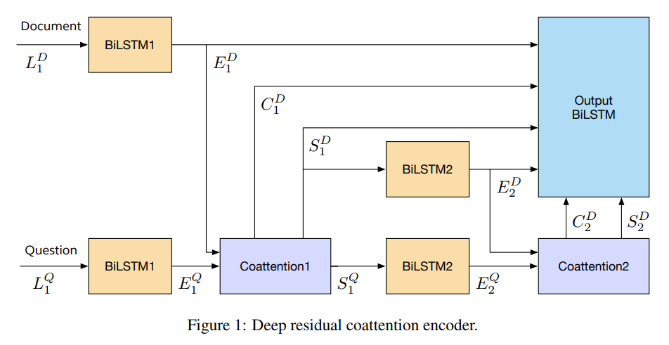
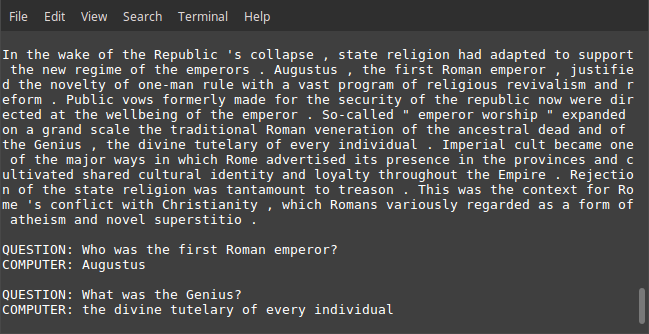

Dynamic Coattention Network Plus - Question Answering
=====================================================

## Introduction

SQuAD (Stanford Question Answering Dataset)[3][4] formulates a machine learning problem where the model receives a question and a passage and is tasked with answering the question using the passage. The answers are limited to spans of text. The training data consists of (question, paragraph, answer span) triplets. Due to the nature of the task, combining the information contained in the passage with the question posed is paramount to achieve good performance (See references for more information). Recurrent neural networks that combine the information from the question and paragraph using coattention mechanisms such as [1] and [2] have achieved the best results in the task so far.

## Networks

### Dynamic Coattention Network Plus (DCN+)

DCN+ encoder combines the question and passage using a dot-product based coattention mechanism, similar to the Transformer Network. The decoder is application specific, specifically made for finding an answer span within a passage, it uses an iterative mechanism for recovering from local minima. Instead of mixed objective the implementation uses cross entropy as in vanilla DCN.



For the implementation see `dcn_plus.py`. An effort has been made to document each component. Each component of the encoder (coattention layer, affinity softmax masking, sentinel vectors and encoder units) and certain parts of the application specific decoder are modular and can easily be used with other networks.

### Baseline model
Simple baseline model (BiLSTM + DCN-like Coattention + Naive decoder). The baseline model achieves ~0.46 F1 (limited to paragraphs below 300 words and questions below 25 words) on the development set after testing a few hyperparameters.

Starting point for hyperparameters
```
Steps = 15000
Word embedding size = 100
Hidden state size = 100
Optimizer = Adam
Learning Rate = 0.01
Decay = Exponential (Staircase)
Decay Steps = 4500
Decay Rate = 0.5

Achieves dev F1 = ~0.46 (300 max length paragraph, 25 max length questions)
```
Increasing embedding size and state size should improve performance further.

To achieve higher performance at the cost of longer training while maintaining faster training time than DCN+, use the DCN+ encoder and a naive decoder by importing the DCN+ encoder into `baseline_model.py`. Using the DCN+ encoder with a naive decoder achieves >0.60 Dev F1 with similar settings as baseline.

### Todos
- Character embeddings
- Sparse mixture of experts

## Instructions

### Dependencies

The project requires Python 3.6 with TensorFlow 1.4. Support for prior versions will not be added.

### Getting started

Move under the project folder (the one containing the README.md)

1. Install the requirements (you may want to create and activate a virtualenv)
``` sh
$ pip install -r requirements.txt
```

2. To download squad run
``` sh
$ wget https://rajpurkar.github.io/SQuAD-explorer/dataset/train-v1.1.json https://rajpurkar.github.io/SQuAD-explorer/dataset/dev-v1.1.json -P download/squad/
```
Download punkt if needed
``` sh
$ python -m nltk.downloader punkt
```
then preprocess SQuAD using
``` sh
$ python question_answering/preprocessing/squad_preprocess.py
```
While the preprocessing is running you can continue with Step 3 in another terminal in the project folder. 

3. Issue the command
``` sh
$ wget http://nlp.stanford.edu/data/glove.6B.zip -P download/dwr/
```
to download Wikipedia 100/200/300 dimensional GLoVe word embeddings (~800mb) or
``` sh
$ wget http://nlp.stanford.edu/data/glove.42B.300d.zip -P download/dwr/
```
for Common Crawl 300 dimensional GLoVe word embeddings (~1.8gb). Common Crawl requires at least 4 hours of processing while Wikipedia 100 dimensional GLoVE finishes in about half an hour.

Extract the Wikipedia embeddings
``` sh
$ tar -xzf download/dwr/glove.6B.zip --directory download/dwr/
```
or the Common Crawl embeddings
``` sh
$ tar -xzf download/dwr/glove.42B.300d.zip --directory download/dwr/
```
4. When Step 2 and 3 are complete change directory to the one containing the code (`qa_data.py` etc.) and run
``` sh
$ python qa_data.py --glove_dim <EMBEDDINGS_DIMENSIONS> --glove_source <SOURCE>
```
replacing `<EMBEDDINGS_DIMENSIONS>` by the word embedding size you want (100, 200, 300) and `<SOURCE>` by `wiki` if using Wikipedia embeddings and `crawl` if using common crawl embeddings (you may omit `--glove_dim` if you choose `crawl`). `qa_data.py` will process the embeddings and create a 95-5 split of the training data where the 95% will be used as a training set and the rest is a development set.

Once complete run (Additionally, you may need to comment out the line importing `cat.py` in `train.py`.)
``` sh
$ python train.py
```
to train the network. Checkpoints and logs will be placed under a timestamped folder in the `../checkpoints` folder. `train.py` contains all hyperparameters for the model.

### Tensorboard
For Tensorboard, run
``` sh
$ tensorboard --logdir checkpoints
```
from the project folder and navigate to `localhost:6006`. The gradient norm and learning rate should be present among other metrics. The computational graph can also be viewed.

### Interactive Shell



To see a trained model in action, load your model in mode `shell` and ask it questions about passages. 

## Acknowledgements

The project uses code from Stanford's CS224n to read and transform the original SQuAD dataset together with the GLoVe vectors to an appropriate format for model development. These files or functions have been annotated with "CS224n" at the beginning.

## References

[1] Dynamic Coattention Networks For Question Answering, Xiong et al, https://arxiv.org/abs/1611.01604

[2] DCN+: Mixed Objective and Deep Residual Coattention for Question Answering, Xiong et al, https://arxiv.org/abs/1711.00106

[3] SQuAD: 100,000+ Questions for Machine Comprehension of Text, Rajpurkar et al, https://arxiv.org/abs/1606.05250

[4] https://rajpurkar.github.io/SQuAD-explorer/

## Author
André Jonasson / [@andrejonasson](https://github.com/andrejonasson)